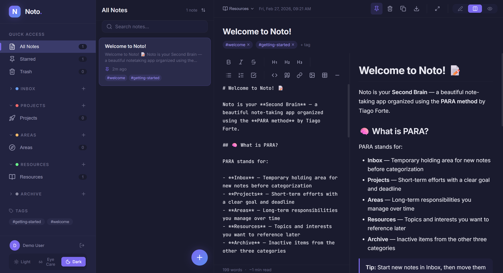
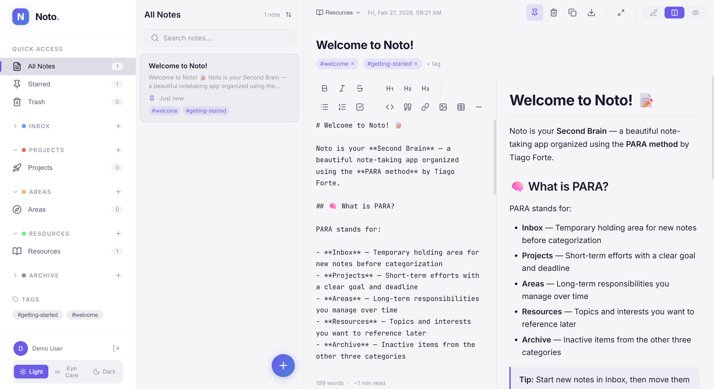
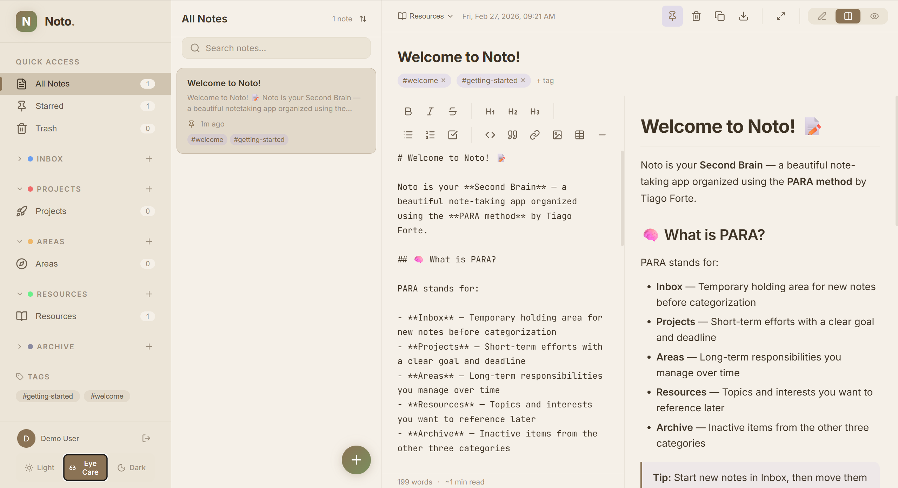

<div align="center">

  

  <h1>Noto 3.0</h1>
  <p><strong>Your second brain, beautifully organised.</strong></p>

  [](https://fauzanalfi.github.io/noto-noto)
  [](CHANGELOG.md)
  [](https://react.dev)
  [](https://firebase.google.com)
  [](https://vitejs.dev)
  [](LICENSE)

</div>

---

## ✨ Features

### Core
- **PARA Method + Inbox** — Organise notes into Inbox (holding area), Projects, Areas, Resources & Archive
- **Markdown Editor** — Full toolbar with Bold, Italic, Headings, Lists, Code, Links, and more; syntax-highlighted preview
- **Flexible Split Preview** — Edit with left/right or top/bottom split preview, or preview-only mode
- **Notebooks & Tags** — Flexible hierarchy with coloured notebooks and free-form tagging (with `tagIn` enter animation)
- **Pin & Trash** — Star important notes; soft-delete with full restore support
- **Tasks View** — Aggregated checklist across all notes; toggle task completion inline
- **Kanban Board** — Board view with Backlog / In Progress / Done columns and drag-and-drop (card lift on drag)
- **Quick Switcher** — `⌘K` / `Ctrl+K` to jump to any note instantly
- **Zen Mode** — Distraction-free writing with a 720 px centred editor and chrome that fades on idle
- **Real-time Sync** — Powered by Firebase Firestore; all devices stay in sync
- **Three Themes** — Dark, Light, and Eye Care (warm sepia)
- **PWA Ready** — Installable on desktop and mobile, works offline-aware
- **Export** — Export notes as `.md`, `.md zip` (current list or all notes), or full JSON backup
- **Demo Mode** — Runs without Firebase credentials using localStorage (used on demo deployment)
- **Google Auth** — Secure sign-in; notes are private to each account

### New in 3.0
- **Brand refresh** — Noto is now branded as **Noto 3.0** across product documentation.
- **Editorial redesign direction** — Design system now captures the latest “Digital Curator” direction: content-first layout, tonal depth, and reduced visual noise.
- **Design principles update** — Added explicit guidance for no-line boundaries, tonal layering, and focused motion.
- **Typography direction update** — Documentation now specifies dual-voice typography (sans for UI chrome, serif for long-form reading contexts).
- **Token documentation update** — Design token metadata bumped to `3.0.0` to reflect the redesign documentation release.

## 🖼️ Screenshots

<table>
  <tr>
    <td><strong>Dark Theme</strong></td>
    <td><strong>Light Theme</strong></td>
  </tr>
  <tr>
    <td></td>
    <td></td>
  </tr>
  <tr>
    <td><strong>Eye Care Theme</strong></td>
    <td></td>
  </tr>
  <tr>
    <td></td>
    <td></td>
  </tr>
</table>

## 🛠️ Tech Stack

| Layer | Technology |
|---|---|
| Frontend | React 19, Vite 7 |
| Styling | Plain CSS with W3C DTCG design tokens |
| Icons | Lucide React |
| Auth | Firebase Authentication (Google) |
| Database | Firebase Firestore |
| Markdown | `marked` + `DOMPurify` |
| Syntax Highlighting | `highlight.js` |
| Fonts | Inter (UI), JetBrains Mono (code) |
| Deployment | Vercel |

## 🚀 Getting Started

### Prerequisites

- Node.js ≥ 18
- A [Firebase](https://console.firebase.google.com) project with **Authentication** (Google provider) and **Firestore** enabled

### Installation

```bash
# 1. Clone the repo
git clone https://github.com/your-username/noto-noto.git
cd noto-noto

# 2. Install dependencies
npm install

# 3. Configure environment variables
cp .env.example .env
# Fill in your Firebase credentials in .env

# 4. Start development server
npm run dev
```

### Environment Variables

Create a `.env` file in the project root:

```env
VITE_FIREBASE_API_KEY=your_api_key
VITE_FIREBASE_AUTH_DOMAIN=your_project.firebaseapp.com
VITE_FIREBASE_PROJECT_ID=your_project_id
VITE_FIREBASE_STORAGE_BUCKET=your_project.firebasestorage.app
VITE_FIREBASE_MESSAGING_SENDER_ID=your_sender_id
VITE_FIREBASE_APP_ID=your_app_id
```

> ⚠️ Never commit your `.env` file. It is already listed in `.gitignore`.

## 📦 Build & Deploy

```bash
# Production build
npm run build

# Preview production build locally
npm run preview

# Deploy to Vercel
vercel --prod
```

For GitHub Pages demo deployment, follow the GitHub Actions steps in [DEPLOYMENT.md](DEPLOYMENT.md#6-deploy-to-github-pages).

## 🔒 Firestore Security Rules

Ensure notes are private per user. Apply these rules in the Firebase Console:

```
rules_version = '2';
service cloud.firestore {
  match /databases/{database}/documents {
    match /users/{userId}/{document=**} {
      allow read, write: if request.auth != null && request.auth.uid == userId;
    }
  }
}
```

## 📁 Project Structure

```
noto-noto/
├── docs/
│   ├── design-system/  # Full design system documentation & tokens
│   │   ├── 01-foundations/   # Colour, typography, spacing, motion, grid
│   │   ├── 02-tokens/        # tokens.json (W3C DTCG format)
│   │   ├── 03-components/    # Per-component specs
│   │   ├── 04-patterns/      # Layout & interaction patterns
│   │   └── 05-dev-guide/     # Theming, accessibility, setup notes
│   └── APP_DOCUMENTATION.md
├── public/             # Static assets, favicon, PWA manifest
├── src/
│   ├── components/
│   │   ├── Editor.jsx
│   │   ├── LoginScreen.jsx   # Noto 3.0 centred-card login
│   │   ├── NotesList.jsx
│   │   ├── NoteToolbar.jsx
│   │   ├── Onboarding.jsx    # 3-step first-run modal
│   │   ├── Settings.jsx      # 2-pane settings overlay
│   │   ├── Sidebar.jsx
│   │   └── …
│   ├── hooks/          # useNotes, useNoteActions, useAuth, useTheme, …
│   ├── assets/
│   ├── test/
│   ├── App.jsx         # Root layout, global keyboard shortcuts, mobile tab bar
│   ├── firebase.js     # Firebase initialisation
│   ├── index.css       # Design tokens + all component styles
│   └── utils.js        # Helper functions
├── .env                # Local environment variables (gitignored)
├── vite.config.js
└── vercel.json
```

## 📚 Documentation

- [App Documentation](docs/APP_DOCUMENTATION.md) — architecture, data model, hooks, and operational notes
- [Design System](docs/design-system/index.md) — tokens, component specs, patterns, and theming guide
- [Deployment Guide](DEPLOYMENT.md) — hosting and deployment options
- [Changelog](CHANGELOG.md) — recent project updates

## ⌨️ Keyboard Shortcuts

| Shortcut | Action |
|---|---|
| `⌘K` / `Ctrl+K` | Open Quick Switcher |
| `⌘N` / `Ctrl+N` | New note |
| `⌘S` / `Ctrl+S` | Flash saved confirmation |
| `⌘F` / `Ctrl+F` | Focus search box |
| `⌘1` / `Ctrl+1` | Edit-only view |
| `⌘2` / `Ctrl+2` | Preview-only view |
| `⌘3` / `Ctrl+3` | Split horizontal view |
| `⌘4` / `Ctrl+4` | Toggle Zen mode |
| `Esc` | Dismiss Quick Switcher → Settings → Zen mode |

## 🌐 Community & Governance

- [Code of Conduct](.github/CODE_OF_CONDUCT.md)
- [Contributing Guide](CONTRIBUTING.md)
- [Security Policy](.github/SECURITY.md)
- [Bug Report Template](.github/ISSUE_TEMPLATE/bug_report.md)
- [Feature Request Template](.github/ISSUE_TEMPLATE/feature_request.md)
- [Pull Request Template](.github/pull_request_template.md)

## 🧪 Testing

Tests are written with Vitest and React Testing Library.

```bash
# Run tests in watch mode
npm test

# Run tests once (CI mode)
npm run test:run

# Open Vitest UI
npm run test:ui
```

Coverage includes utility functions (`utils.js`) and custom hooks (`useDebounce`, `useNoteActions`).

## 🤝 Contributing

Contributions are welcome! Please open an issue first to discuss what you'd like to change.

1. Fork the repository
2. Create a feature branch: `git checkout -b feat/your-feature`
3. Commit your changes: `git commit -m 'feat: add your feature'`
4. Push to the branch: `git push origin feat/your-feature`
5. Open a Pull Request

## 📄 License

Distributed under the [MIT License](LICENSE).

---

<div align="center">
  Made with ☕ by <a href="https://github.com/fauzanalfi">Fauzan</a>
</div>